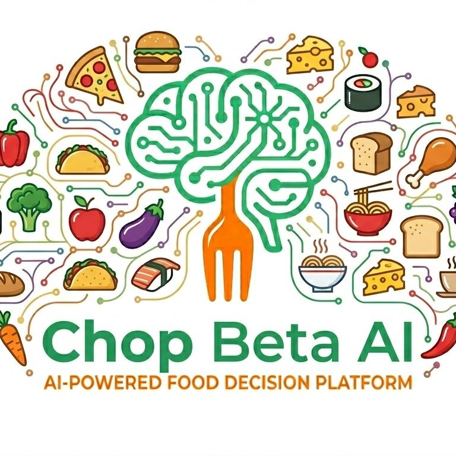

<p align="center">
  
</p>

<h1 align="center">Chop Beta AI 🍲🤖</h1>

<p align="center">
  <a href="https://nextjs.org/"></a>
  <a href="https://react.dev/"></a>
  <a href="https://www.typescriptlang.org/"></a>
  <a href="https://tailwindcss.com/"></a>
  <a href="https://appwrite.io/"></a>
  <a href="https://www.framer.com/motion/"></a>
  <a href="https://opensource.org/licenses/MIT"></a>
</p>

<p align="center">
  <strong>Eat Smart. Live Well. Powered by AI.</strong><br />
  An AI-driven food intelligence and decision platform tailored for Nigeria — bridging wellness goals, budgets, and everyday local delicacies.
</p>

---

## 📖 Table of Contents

- [Overview](#-overview)
- [Why Chop Beta AI?](#-why-chop-beta-ai)
- [Key Features](#-key-features)
- [Local Meal Showcase](#-local-meal-showcase)
- [Tech Stack](#-tech-stack)
- [Project Structure](#-project-structure)
- [Getting Started](#-getting-started)
  - [Prerequisites](#prerequisites)
  - [Installation](#installation)
  - [Environment Configuration](#environment-configuration)
  - [Running the Development Server](#running-the-development-server)
  - [Available Scripts](#available-scripts)
- [Waitlist & Appwrite Integration](#-waitlist--appwrite-integration)
- [Roadmap](#-roadmap)
- [Contributing](#-contributing)
- [License](#-license)

---

## 🌟 Overview

**Chop Beta AI** is an intelligent food decision platform designed specifically for the African context, starting with Nigeria. 

Most existing nutrition and meal-planning platforms cater to Western diets, featuring ingredients that are hard to find, excessively expensive, or culturally disconnected from everyday life in Nigeria. **Chop Beta AI** fixes this disconnect by pairing state-of-the-art AI recommendations with familiar, nourishing Nigerian staples — such as Jollof Rice, Efo Riro with Amala, Moi Moi, Akara, Beans & Plantain, and hearty Pepper Soups.

Whether you are a busy university student balancing lectures and allowances, or a working professional managing a packed schedule, Chop Beta AI helps you eat healthy without breaking your budget or sacrificing the flavours you cherish.

---

## 🎯 Why Chop Beta AI?

Modern living in Nigeria comes with specific food challenges that generic fitness apps ignore:

1. **Busy Schedules & Decision Fatigue**  
   Long commutes, demanding jobs, exams, and tight schedules often lead to last-minute, low-nutrition food choices.
2. **Budget-Conscious Meal Planning**  
   Food choices must align with real-world spending limits and local market realities. Recommendations should reflect what is accessible and affordable around you.
3. **Culturally Relevant Food Intelligence**  
   Local meals like swallows, vegetable soups, beans, yam, and plantain deserve nuanced nutritional analysis, portion suggestions, and healthy preparation techniques.

---

## ✨ Key Features

- 🧠 **AI Nutritional Mapping:** Personalised dietary recommendations and nutrient profiling adapted to your health objectives (weight management, muscle gain, energy, or clean eating).
- 🇳🇬 **Nigerian Food Intelligence:** Deep contextual database of local recipes, portion estimation, cooking methods, and ingredient alternatives.
- 📅 **Predictive Meal Scheduling:** Plan meals days or weeks in advance, complete with batch-cooking strategies and grocery lists.
- 💰 **Budget & Market Fit:** Tailor food ideas to current price points, availability, and student/family budgets.
- 📱 **Multi-Persona Experience:** Customised interfaces for students with campus constraints and working professionals.
- ⚡ **Accessible & Responsive Design:** High-performance web experience with fluid animations, mobile-first responsiveness, and screen-reader accessibility.
- 💌 **Early Access Waitlist with Appwrite:** Built-in interactive waitlist backed by Appwrite Databases with live duplicate prevention and real-time feedback.

---

## 🍲 Local Meal Showcase

Chop Beta AI celebrates authentic local cuisines with intelligent nutritional breakdowns:

| Meal | Category | Nutritional Highlights |
| :--- | :--- | :--- |
| **Jollof Rice** | Rice-based / One-pot | Slow-cooked tomato reduction, rich in antioxidants, customizable protein pairings |
| **Efo Riro + Amala** | Soup & Swallow | Nutrient-dense leafy greens, iron, fibre, complex carbohydrates |
| **Moi Moi + Akara** | Plant Protein | High-fibre steamed or lightly fried bean batter, rich in plant protein and B-vitamins |
| **Beans & Fried Plantain** | Comfort Classic | Balanced slow-burning carbohydrates, dietary fibre, and potassium |
| **Spiced Pepper Soup** | Warm Broth | Infused with native herbs and spices (calabash nutmeg, uda, uziza) supporting digestion |

---

## 🛠️ Tech Stack

### Frontend & Framework
- **[Next.js 14](https://nextjs.org/)** — React framework with App Router, server-rendered layouts, and API Route Handlers.
- **[React 18](https://react.dev/)** — Interactive component architecture.
- **[TypeScript 5](https://www.typescriptlang.org/)** — Strict type safety for maintainable code.

### Backend & Database
- **[Appwrite](https://appwrite.io/)** — Open-source Backend-as-a-Service (BaaS) providing scalable document databases.
- **[node-appwrite](https://github.com/appwrite/sdk-for-node)** — Official Appwrite Server SDK for secure server-side data operations.

### Styling & Animation
- **[Tailwind CSS](https://tailwindcss.com/)** — Utility-first styling with custom design tokens and palette.
- **[Framer Motion](https://www.framer.com/motion/)** — Smooth page transitions, staggered entrance animations, and reduced-motion fallbacks.
- **[PostCSS](https://postcss.org/) & [Autoprefixer](https://github.com/postcss/autoprefixer)** — Modern CSS compilation.

### Typography & Icons
- **Fonts**: `Plus Jakarta Sans` (headings) and `Inter` (body) loaded via `next/font/google`.
- **Icons**: Custom vector SVGs designed for high contrast and accessibility.

---

## 📁 Project Structure

```text
ChopBeta-AI/
├── app/
│   ├── api/
│   │   └── waitlist/
│   │       └── route.ts     # Next.js server route handling Appwrite waitlist signups
│   ├── globals.css          # Global CSS, design tokens, and utility classes
│   ├── icon.png             # Application favicon and touch icons
│   ├── layout.tsx           # Root HTML layout, font setup, and SEO metadata
│   └── page.tsx             # Main landing page assembling all feature sections
├── appwrite/
│   └── setup-guide.md       # Step-by-step Appwrite Cloud configuration guide
├── components/
│   ├── FeaturesSection.tsx  # Core platform feature cards
│   ├── FooterSection.tsx    # Footer with brand links and copyright
│   ├── HeroIllustration.tsx # Custom SVG/vector illustration for hero section
│   ├── HeroSection.tsx      # Landing hero with headline, CTAs, and badges
│   ├── HowItWorksSection.tsx# 3-step platform walkthrough
│   ├── Icons.tsx            # Custom SVG icon components
│   ├── Logo.tsx             # Chop Beta AI brand logo
│   ├── MealIllustrations.tsx# Visual previews for Nigerian dishes
│   ├── MealShowcaseSection.tsx # Interactive scrollable meal carousel
│   ├── Navbar.tsx           # Responsive navigation with mobile menu
│   ├── ProblemSection.tsx   # Pain points and Nigerian context overview
│   ├── Reveal.tsx           # Framer Motion scroll-reveal wrapper
│   ├── WaitlistSection.tsx  # Interactive waitlist form with live validation
│   └── ui/
│       ├── button.tsx       # Reusable button component
│       └── input.tsx        # Reusable styled input component
├── lib/
│   ├── appwrite.ts          # Appwrite server client initialization & helpers
│   ├── utils.ts             # Tailwind class merging utility (clsx + twMerge)
│   └── waitlist.ts          # Waitlist client validation logic & API bridge
├── public/
│   └── images/              # Platform logo, dish photography, and textures
├── .env.example             # Template for Appwrite environment variables
├── .eslintrc.json           # ESLint configuration
├── .gitignore               # Ignored directories and sensitive files
├── next.config.mjs          # Next.js build and optimization config
├── package.json             # Dependencies and npm scripts
├── postcss.config.mjs       # PostCSS plugins config
├── tailwind.config.ts       # Tailwind CSS custom themes, colors, and fonts
└── tsconfig.json            # TypeScript compiler configuration
```

---

## 🚀 Getting Started

### Prerequisites

Make sure you have the following installed on your machine:
- **[Node.js](https://nodejs.org/)** (v18.17.0 or higher recommended)
- **npm** (v9+), **yarn**, or **pnpm**
- **Git**

### Installation

1. **Clone the repository:**
   ```bash
   git clone https://github.com/adeyanjufuhad/ChopBeta-AI.git
   cd ChopBeta-AI
   ```

2. **Install dependencies:**
   ```bash
   npm install
   ```

### Environment Configuration

Copy the example environment file:

```bash
cp .env.example .env.local
```

Fill in your Appwrite credentials in `.env.local`:

```bash
APPWRITE_ENDPOINT=https://cloud.appwrite.io/v1
APPWRITE_PROJECT_ID=your_project_id
APPWRITE_API_KEY=your_secret_api_key
APPWRITE_DATABASE_ID=your_database_id
APPWRITE_COLLECTION_ID=waitlist
```

> [!NOTE]
> See [appwrite/setup-guide.md](appwrite/setup-guide.md) for a quick 2-minute walkthrough on setting up your Appwrite Database and Collection.

### Running the Development Server

Start the local Next.js development server:

```bash
npm run dev
```

Open [http://localhost:3000](http://localhost:3000) with your browser to explore the landing page.

### Available Scripts

| Command | Description |
| :--- | :--- |
| `npm run dev` | Runs the Next.js development server on port `3000` |
| `npm run build` | Compiles the production build |
| `npm run start` | Starts the production server after building |
| `npm run lint` | Runs ESLint to identify code style or syntax issues |
| `npm run typecheck` | Validates TypeScript types across the entire project |

---

## 🔌 Waitlist & Appwrite Integration

The waitlist form in `components/WaitlistSection.tsx` connects directly to the Next.js server route at `app/api/waitlist/route.ts`, which interacts with Appwrite Databases:

- **Server-Side Security**: Database operations run server-side with your private API key—credentials are never exposed to the client.
- **Duplicate Prevention**: Before creating a new entry, the endpoint checks if the email is already registered using Appwrite Queries (`Query.equal('email', email)`).
- **Graceful Fallback**: If Appwrite environment variables are not yet configured during development, the system runs safely in preview mode without throwing errors.
- **Audience Segmentation**: Stores whether the user is a `student` or `general` user.

---

## 🗺️ Roadmap

- [x] Responsive landing page with Nigerian food intelligence showcase
- [x] Interactive waitlist registration with real-time validation
- [x] Custom meal illustration suite and interactive cards
- [x] Cloud Database integration with Appwrite for waitlist signups & duplicate detection
- [ ] Automated welcome email sequence via Resend / SendGrid
- [ ] AI meal recommendation engine beta test
- [ ] Native Mobile App (iOS & Android) powered by React Native / Flutter
- [ ] Local ingredient price tracker & marketplace integration

---

## 🤝 Contributing

Contributions are what make the open-source community an inspiring place to learn, create, and build. Any contributions you make are **greatly appreciated**!

1. Fork the Project
2. Create your Feature Branch (`git checkout -b feature/AmazingFeature`)
3. Commit your Changes (`git commit -m 'Add some AmazingFeature'`)
4. Push to the Branch (`git push origin feature/AmazingFeature`)
5. Open a Pull Request

---

## 📄 License

This project is licensed under the MIT License — see the [LICENSE](LICENSE) file for details.